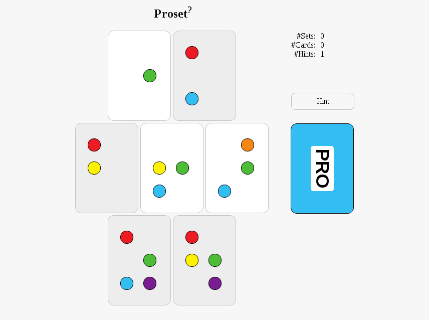

# Proset

## [Play it]

The game consists of a set of 63 cards with six placeholders for six colored dots: red, orange, yellow, green, blue, and purple. Each dot can either be or be not presented on a card. There are 63 cards with all possible combinations of dots. Each round, seven cards are dealt. The aim of the game is to find a set of seven cards such that, for each color, there are even number of dots in total. For example, on the picture below, the set consists of four gray cards. There are 4 red, 0 orange, 2 yellow, 2 green, 2 blue, and 2 purple dots.

## License
See the [LICENSE](LICENSE.md) file for license rights and limitations (MIT).

## Attribution
The BlondelBraille [font](BlondelBraille.ttf) belongs to its author.

   [Play it]: <https://murfel.github.io/proset/>
